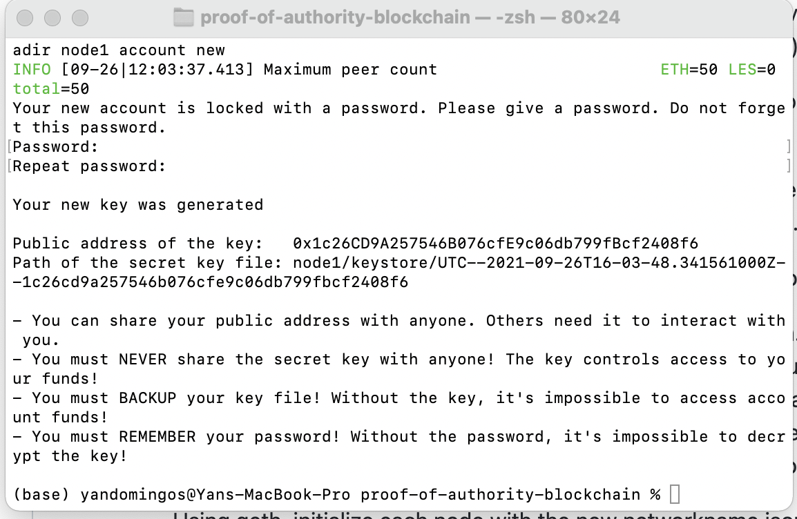
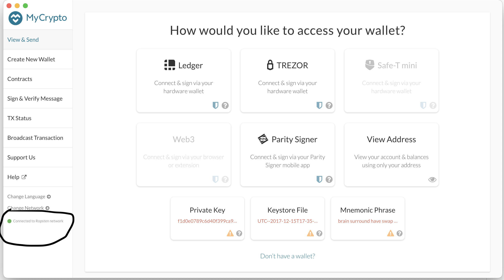
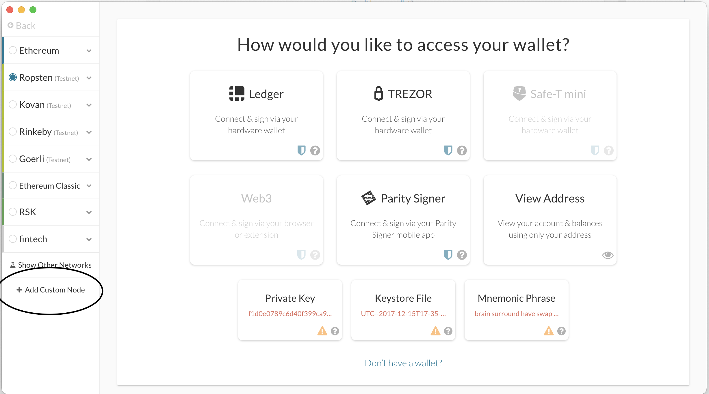
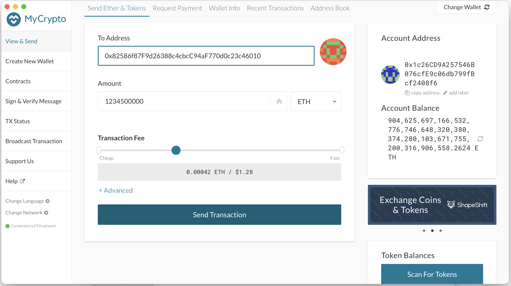
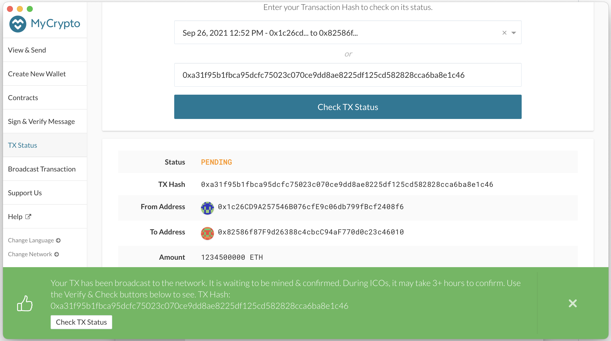
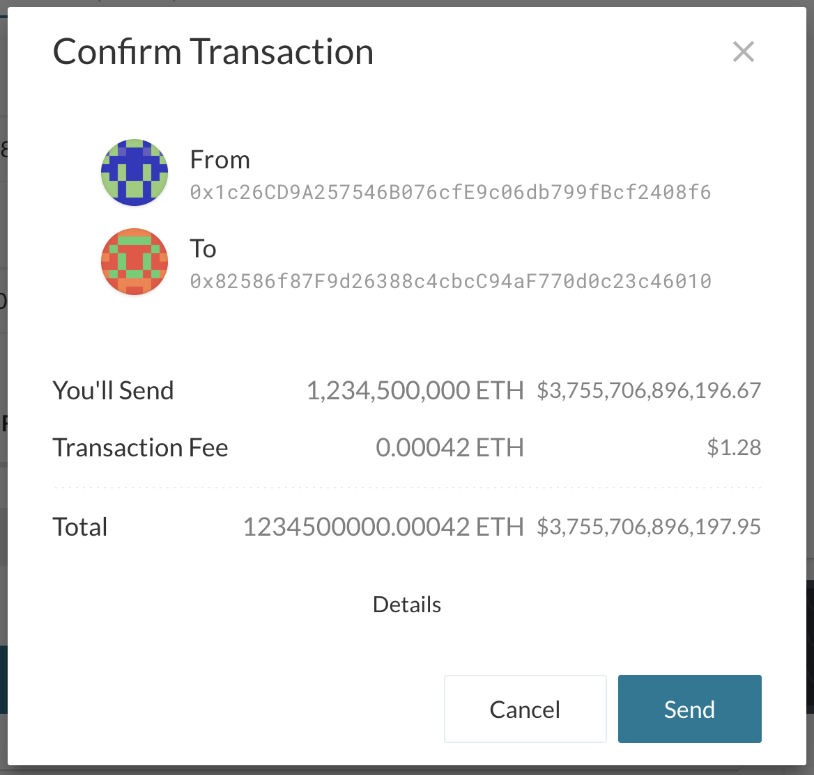
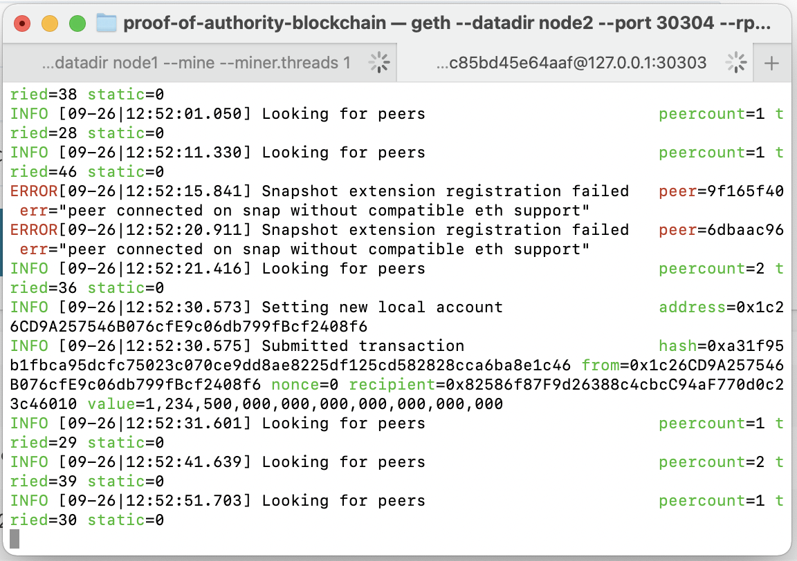

# Proof of Authority - BlockChain

This project intends to represent a 'mock' of real life Proof of Authority (PoA) algorithm in action. PoA is usually used for private blockchian networks as it requires approval for transaction to go through (seal blocks).

Below is the explanation - step-by-step - for this project:

1. Must create two node account for the network with a separate datadir for each; using geth. : a) ./geth --datadir node1 account new , b)  ./geth --datadir node2 account new

2. Generate genesis block: 
    a) Navite to ./puppeth
    b) Type 2 to pick the Configure new genesis option, then 1 to Create new genesis from scratch
    c)Type 1 to choose Proof of Work and continue
    d)Paste both account addresses from the first step one at a time into the list of accounts to seal
    e) You can choose no for pre-funding the pre-compiled accounts (0x1 .. 0xff) with wei
    f)Complete the rest of the prompts, and when you are back at the main menu, choose the "Manage existing genesis" option
    g)Export genesis configurations. This will fail to create two of the files, but you only need networkname.json
    h)initialize the nodes with the genesis' json file.

3. Initialize each node with the new newworkname.jason:
    a) In terminal, type in: ./geth --datadir node1 init networkname.json
    b) In terminal, type: ./geth --datadir node2 init networkname.json

4. Running nodes and getting it ready to mine:
    a)Open two terminal tabs and run the following:
    b) ./geth --datadir node1 --mine --miner.threads 1
    c) once node1 is running, you must be quick to copy/paste the node address so node2 can locate 1 to initialize properly
    d) run node2: ./geth --datadir node2 --port 30304 --rpc --bootnodes "enode://<replace with node1 enode address>"

With both nodes running, the blockchain can be added to MyCrypto for testing.

5. Configuring the BlockChain in MyCrypto:
    a)Open the MyCrypto app, then click Change Network at the bottom left: change network.
    b) Click "Add Custom Node", then add the custom network information that you set in the genesis.
    c) Make sure that you scroll down to choose Custom in the "Network" column to reveal more options like Chain ID
    d) The URL must point to the default RPC port on your local machine. Use http://127.0.0.1:8545, type in ETH for custom currency
    e) Once you save and use the network, double-check that it is selected and is connected.

After connecting to the custom network in MyCrypto, it can be tested by sending money between accounts.

6. Opening your wallet from the nodes you created: 
    a) Select the View & Send option from the left menu pane, then click Keystore file. select_keystore_file
    b) On the next screen, click Select Wallet File, then navigate to the keystore directory inside your Node1 directory, select the file located there, provide your password when prompted and then click Unlock.
    c)Testnets usually fund a lot of ETH into accounts, you will most likely never need to use a faucet to fund more test ETH to your acount.

7. Sending transactions between accounts: 
    a)In the To Address box, type the account address from Node2, then fill in an arbitrary amount of ETH, click transaction send
    b) Confirm the transaction by clicking "Send Transaction", and the "Send" button in the pop-up window. Send transaction alt text
    c) Click the Check TX Status when the green message pops up, confirm the logout: check tx

You should see the transaction go from Pending to Successful in around the same blocktime you set in the genesis.

